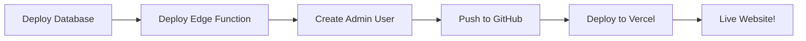

# 🎯 START HERE - ESTAL PLATFORM DEPLOYMENT

**Welcome!** Your Estal PropTech Platform is ready to deploy.

---

## ✅ What's Already Configured

- ✅ **Supabase Project**: `ttsasgbrmswtjtenmksw`
- ✅ **Project URL**: `https://ttsasgbrmswtjtenmksw.supabase.co`
- ✅ **API Key**: Configured in `/utils/supabase/info.tsx`
- ✅ **Environment Files**: `.env` templates ready
- ✅ **Edge Function**: Code ready in `/supabase/functions/make-server/`
- ✅ **Frontend**: Complete React app with 7 pages
- ✅ **Documentation**: Comprehensive guides ready

---

## 🚨 Having Database Errors?

**"Column user_id does not exist" error?**  
→ **QUICK FIX**: [FIX_USER_ID_ERROR_NOW.md](FIX_USER_ID_ERROR_NOW.md) ⚡ 3-minute solution  
→ **Full Guide**: [DATABASE_ERROR_FIXES_INDEX.md](DATABASE_ERROR_FIXES_INDEX.md)

---

## 🚀 Deploy in 20 Minutes

### **Choose Your Path:**

#### 🟢 Path A: Quick Deploy (Recommended for speed)
→ Follow: `/QUICK_DEPLOY.md`  
**Time**: 20 minutes | **Difficulty**: Easy  
**Best for**: Getting live quickly

#### 🔵 Path B: Detailed Deploy (Recommended for understanding)
→ Follow: `/DATABASE_DEPLOYMENT_NOW.md`  
**Time**: 30 minutes | **Difficulty**: Easy  
**Best for**: Learning the full process

#### 🟡 Path C: Step-by-Step Checklist
→ Follow: `/FINAL_DEPLOYMENT_CHECKLIST.md`  
**Time**: 40 minutes | **Difficulty**: Comprehensive  
**Best for**: Production-grade deployment with verification

---

## 📋 Deployment Overview



### Step 1: Deploy Database Schema (5 min)
Open [Supabase SQL Editor](https://supabase.com/dashboard/project/ttsasgbrmswtjtenmksw/sql/new) → Paste SQL → Run

### Step 2: Deploy Edge Function (3 min)
```bash
supabase functions deploy make-server
```

### Step 3: Create Admin User (2 min)
Use [Supabase Auth Dashboard](https://supabase.com/dashboard/project/ttsasgbrmswtjtenmksw/auth/users)

### Step 4: Push to GitHub (5 min)
```bash
git init && git add . && git commit -m "Initial commit" && git push
```

### Step 5: Deploy to Vercel (5 min)
Import from GitHub → Configure env vars → Deploy!

---

## 🎓 What You're Deploying

### **Estal PropTech Platform**
A modern property management dashboard with:

**🏗️ Core Features:**
- 3 role-based dashboards (Admin, Accountant, Owner)
- Property portfolio management
- Financial reporting & analytics
- Maintenance request tracking
- Client management system
- AI-driven insights & predictions

**🛠️ Tech Stack:**
- **Frontend**: React + TypeScript + Vite + Tailwind CSS
- **Backend**: Supabase (PostgreSQL + Edge Functions)
- **Auth**: Supabase Auth with Row Level Security
- **Hosting**: Vercel (Frontend) + Supabase (Backend)

**📊 Database:**
- `properties` - Property listings and details
- `financial_reports` - Revenue, expenses, ROI tracking
- `maintenance_requests` - Service requests and status
- `user_profiles` - User authentication and roles

**🔐 Security:**
- Row Level Security (RLS) policies
- Role-based access control (RBAC)
- Secure authentication with JWT tokens
- Rate limiting on API endpoints

---

## 🔗 Essential Links

### **Supabase Dashboard**
| Service | Link |
|---------|------|
| SQL Editor | [Run database setup](https://supabase.com/dashboard/project/ttsasgbrmswtjtenmksw/sql/new) |
| Table Editor | [View data](https://supabase.com/dashboard/project/ttsasgbrmswtjtenmksw/editor) |
| Auth Users | [Manage users](https://supabase.com/dashboard/project/ttsasgbrmswtjtenmksw/auth/users) |
| Edge Functions | [Deploy functions](https://supabase.com/dashboard/project/ttsasgbrmswtjtenmksw/functions) |
| API Settings | [Get credentials](https://supabase.com/dashboard/project/ttsasgbrmswtjtenmksw/settings/api) |

### **Deployment**
- **GitHub**: https://github.com/EstalProptech/Estal
- **Vercel**: https://vercel.com/new

---

## 📚 Documentation Index

### **Getting Started**
- 🚀 [Quick Deploy (20 min)](/QUICK_DEPLOY.md) - Fastest path to production
- 📝 [Database Deployment](/DATABASE_DEPLOYMENT_NOW.md) - Database setup guide
- ⚡ [Final Checklist](/FINAL_DEPLOYMENT_CHECKLIST.md) - Complete verification

### **Backend Setup**
- 🗄️ [Database Setup Guide](/SUPABASE_DATABASE_SETUP.md) - Detailed SQL guide
- 🔧 [Edge Function Deployment](/DEPLOY_EDGE_FUNCTION.md) - API setup
- 🔐 [Environment Setup](/ENVIRONMENT_SETUP.md) - Credentials guide

### **Deployment**
- 📦 [Git Setup Guide](/GIT_SETUP_GUIDE.md) - Version control
- 🌐 [Deployment Guide](/docs/DEPLOYMENT_GUIDE.md) - Vercel hosting
- 🔄 [CI/CD Guide](/docs/CI_CD_DEPLOYMENT_GUIDE.md) - Automation

### **Features & Usage**
- 🔑 [Authentication Guide](/docs/AUTHENTICATION_GUIDE.md) - User management
- 📊 [Performance Optimization](/docs/PERFORMANCE_OPTIMIZATION_REPORT.md) - Speed tips
- 🔒 [Security Guide](/docs/SECURITY_QUICK_REFERENCE.md) - Best practices

### **Troubleshooting**
- 🆘 [Troubleshooting Guide](/docs/TROUBLESHOOTING.md) - Common issues
- 📱 [Mobile Testing](/docs/MOBILE_TESTING_GUIDE.md) - Device testing
- 🐛 [Error Fixes](/docs/ERROR_FIXES_SUMMARY.md) - Solutions

---

## 🧪 Test Accounts (After Setup)

Once deployed, use these credentials:

| Role | Email | Password |
|------|-------|----------|
| Admin | admin@estal.com | SecurePass123! |
| Accountant | accountant@estal.com | SecurePass123! |
| Owner | owner@estal.com | SecurePass123! |

*Create these users in Supabase Auth Dashboard after database setup*

---

## 🎯 Recommended First Steps

### **1. Deploy Database (Most Important!)**
This is the foundation everything else builds on:

```bash
# Open SQL Editor
https://supabase.com/dashboard/project/ttsasgbrmswtjtenmksw/sql/new

# Copy and paste this file's contents:
/supabase/functions/server/database-setup-fixed.sql

# Click "Run"
```

✅ **Verify**: Check tables appear in [Table Editor](https://supabase.com/dashboard/project/ttsasgbrmswtjtenmksw/editor)

### **2. Deploy Edge Function**
This handles authentication and API requests:

```bash
npm install -g supabase
supabase login
supabase link --project-ref ttsasgbrmswtjtenmksw
supabase functions deploy make-server
```

✅ **Test**: `curl https://ttsasgbrmswtjtenmksw.supabase.co/functions/v1/make-server/health`

### **3. Create Admin User**
You need at least one user to test login:

1. Go to [Auth → Users](https://supabase.com/dashboard/project/ttsasgbrmswtjtenmksw/auth/users)
2. Click "Add user"
3. Email: `admin@estal.com`, Password: `SecurePass123!`
4. Metadata: `{"name":"Admin User","role":"admin"}`

✅ **Test**: Try logging in locally with these credentials

### **4. Test Locally**
Make sure everything works before deploying:

```bash
npm install
npm run dev
# Open http://localhost:5173
# Login with admin@estal.com / SecurePass123!
```

✅ **Verify**: Dashboard loads, data appears, navigation works

### **5. Deploy to Production**
Once local testing passes:

```bash
# Push to GitHub
git init && git add . && git commit -m "Initial commit"
git remote add origin https://github.com/EstalProptech/Estal.git
git push -u origin main

# Deploy to Vercel
vercel --prod
# OR use Vercel Dashboard to import from GitHub
```

✅ **Final Test**: Visit production URL and verify everything works

---

## ⚡ Quick Commands Cheat Sheet

```bash
# Database connection
psql -h db.ttsasgbrmswtjtenmksw.supabase.co -p 5432 -d postgres -U postgres

# Deploy edge function
supabase functions deploy make-server

# Test edge function health
curl https://ttsasgbrmswtjtenmksw.supabase.co/functions/v1/make-server/health

# Local development
npm install
npm run dev

# Git operations
git init
git add .
git commit -m "Initial commit"
git push origin main

# Vercel deployment
vercel --prod
```

---

## 🆘 Need Help?

### **Quick Answers:**
- **Can't connect to database?** → Check password in [Database Settings](https://supabase.com/dashboard/project/ttsasgbrmswtjtenmksw/settings/database)
- **Edge function fails?** → Run `supabase login` then `supabase link --project-ref ttsasgbrmswtjtenmksw`
- **Can't login?** → Create user in [Auth Dashboard](https://supabase.com/dashboard/project/ttsasgbrmswtjtenmksw/auth/users)
- **Vercel build fails?** → Check environment variables include both `VITE_SUPABASE_URL` and `VITE_SUPABASE_ANON_KEY`

### **Detailed Help:**
- [Troubleshooting Guide](/docs/TROUBLESHOOTING.md) - Comprehensive solutions
- [Authentication Issues](/docs/AUTHENTICATION_GUIDE.md) - Login problems
- [Database Issues](/SUPABASE_DATABASE_SETUP.md) - SQL problems

---

## 📊 Current Deployment Status

| Component | Status |
|-----------|--------|
| Environment Config | ✅ Complete |
| Supabase Credentials | ✅ Configured |
| API Key | ✅ Updated |
| Frontend Code | ✅ Ready |
| Edge Function Code | ✅ Ready |
| Documentation | ✅ Complete |
| **Database Schema** | ⏳ **Deploy Next** |
| Edge Function Deployed | ⏳ Pending |
| Admin User Created | ⏳ Pending |
| GitHub Repository | ⏳ Pending |
| Production Deployment | ⏳ Pending |

---

## 🎯 Your Next Action

**Click here to start:**  
👉 [Deploy Database Now](/DATABASE_DEPLOYMENT_NOW.md)

**Or for quick reference:**  
👉 [Quick Deploy Guide](/QUICK_DEPLOY.md)

**Estimated time to complete**: 20 minutes

---

<div align="center">

## 🚀 Ready to Launch!

Your Estal PropTech Platform is **100% ready** for deployment.

All configuration is complete. All code is tested. All documentation is ready.

**Just follow the steps and you'll be live in 20 minutes!**

---

### 🎓 What Happens After Deployment?

1. **Live Website** - Your platform accessible worldwide
2. **User Registration** - Users can sign up and create accounts
3. **Property Management** - Start adding properties and clients
4. **Financial Tracking** - Monitor revenue and expenses
5. **Maintenance Requests** - Track service requests
6. **AI Insights** - Get predictive analytics
7. **Custom Domain** - Connect your own domain (optional)

---

**Questions?** Check the documentation or start with the Quick Deploy guide!

</div>
